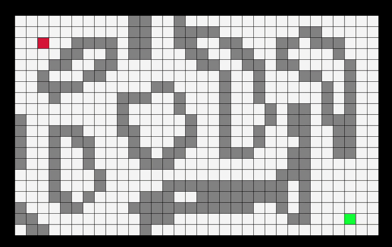

# PathFinder

A grid-based pathfinding visualizer built in C with [raylib](https://www.raylib.com/). Place a start, a goal, and walls on the grid, then watch BFS, DFS, Dijkstra, or A* find the path in real time.

---

## Demos

| BFS | DFS |
|-----|-----|
|  |  |

| Dijkstra | A* |
|----------|----|
|  |  |

---

## Features

- Interactive grid editor — draw walls, set start/goal, and adjust cell weights
- Step-by-step visualization of four classic pathfinding algorithms
  - Breadth-First Search (BFS)
  - Depth-First Search (DFS)
  - Dijkstra's Algorithm
  - A\* (A-Star)
- Variable cell weights for weighted-graph demos
- Built on raylib for cross-platform rendering

---

## Project Structure

```
PathFinder/
├── external/          # Git submodules
│   ├── Logger/        # Logging library
│   └── WIM/           # Data structures & allocators
├── include/           # Header files
├── src/               # C source files
└── CMakeLists.txt
```

> **Logger** and **WIM** are separate projects and are included as git submodules.

---

## Building

### Prerequisites

- CMake ≥ 3.22
- A C11 compiler (GCC, Clang, MSVC)
- Git (to fetch submodules)

> raylib is fetched automatically by CMake via `FetchContent` — no manual installation needed.

### Steps

```bash
# Clone with submodules
git clone --recurse-submodules https://github.com/panagiotisTeas/PathFinder.git
cd PathFinder

# Configure and build
cmake -B build
cmake --build build

# Run
./build/PathFinder
```

If you cloned without `--recurse-submodules`, initialize submodules manually:

```bash
git submodule update --init --recursive
```

---

## Controls

### Grid Editing

| Input | Action |
|-------|--------|
| `LMB` (drag) | Place wall |
| `Shift + LMB` (drag) | Clear cell (path) |
| `RMB` | Set start |
| `Shift + RMB` | Set goal |
| `Shift + C` | Clear grid |
| `Shift + R` | Reset grid (clear visited/path state) |
| `Shift + =` | Increase cell weight |
| `Shift + -` | Decrease cell weight |

### Algorithms

> A **start** and **goal** must be placed before running an algorithm.

| Input | Action |
|-------|--------|
| `Shift + 1` | Run Breadth-First Search |
| `Shift + 2` | Run Depth-First Search |
| `Shift + 3` | Run Dijkstra's Algorithm |
| `Shift + 4` | Run A\* |

Algorithms animate step by step automatically once triggered. Use `Shift + R` to reset the search state and try again.

---

## Dependencies

| Dependency | Source |
|------------|--------|
| [raylib](https://github.com/raysan5/raylib) | Fetched by CMake |
| [Logger](https://github.com/panagiotisTeas/Logger) | Git submodule |
| [WIM](https://github.com/panagiotisTeas/WIM) | Git submodule |

---

## License

This project is licensed under the [MIT License](LICENSE).